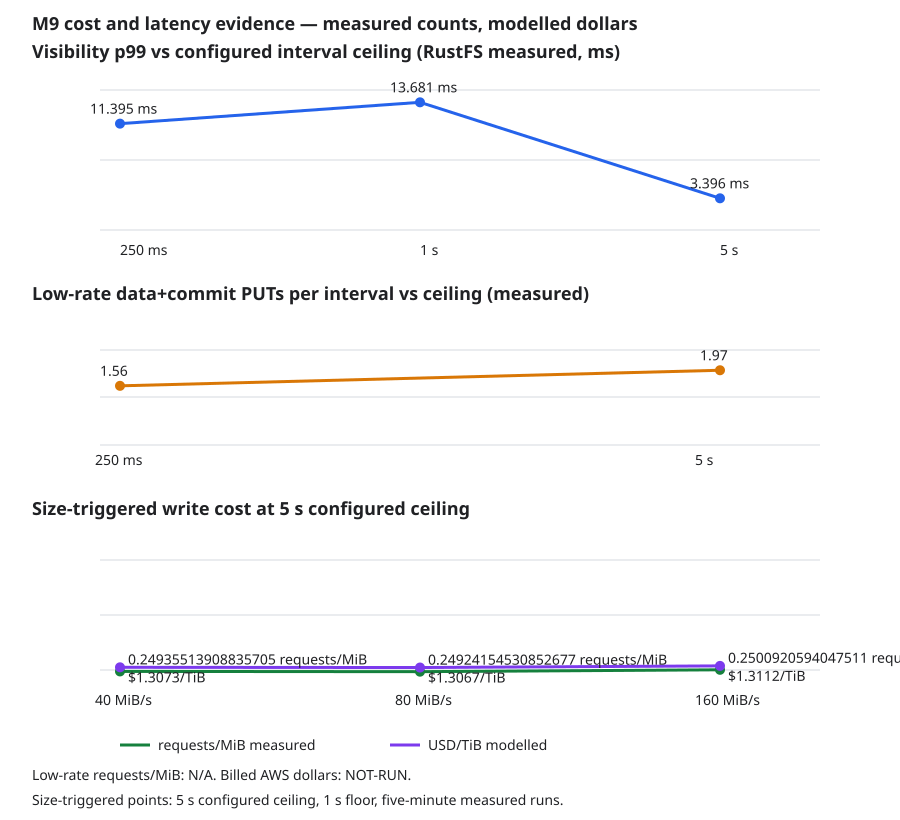

# Cost and latency curve

Generated from the committed files in [results](results/); do not edit this document by hand.
Counts are measured, dollar values are modelled from the AWS S3 Standard price table, and latency is measured on RustFS on this rig.

## Size-triggered writes

| Target rate (MiB/s) | Configured interval floor / ceiling | PUTs | Requests/MiB (measured) | USD/TiB (modelled) | Duration / evidence |
|---:|---:|---:|---:|---:|---|
| 40 | 1000 ms / 5000 ms | 35 | 0.2714 | $1.4229 | 5 s, smoke |
| 80 | 1000 ms / 5000 ms | 35 | 0.2744 | $1.4386 | 5 s, smoke |
| 160 | 1000 ms / 5000 ms | 35 | 0.2722 | $1.4271 | 5 s, smoke |

USD/TiB uses binary 1,048,576 MiB/TiB and the measured PUTs/MiB multiplied by the published AWS PUT price. It is not a billed result. The M9.8 five-second points are smoke measurements; the full five-minute acceptance run remains outstanding.
Source: M9.8's recorded RustFS smoke counts and [ADR-0062](../decisions/0062-nfr-1-has-an-interval-bound-low-rate-regime.md) for the low-rate interpretation.

## Low-rate write budget

The low-rate budget is measured PUTs per interval, not requests per MiB or dollars per TiB; dividing by low payload volume would price the workload rather than the flush policy.

| Interval ceiling | PUTs observed | Elapsed | Ceiling windows | PUTs / interval (measured) | Requests/MiB and USD/TiB |
|---:|---:|---:|---:|---:|---|
| 0.25 s | 24 | 3.07 s | 13 | 1.8462 | N/A — low-rate requests/MiB is not a valid budget (smoke) |
| 5 s | 4 | 5.05 s | 2 | 2 | N/A — low-rate requests/MiB is not a valid budget (smoke) |

## Visibility latency by interval ceiling

| Ceiling | Records | p50 (RustFS measured) | p99 (RustFS measured) | Max (RustFS measured) | 3× bound |
|---:|---:|---:|---:|---:|---:|
| 0.25 s | 10000 | 0.942 ms | 11.395 ms | 11.428 ms | 0.75 s |
| 1 s | 10000 | 0.864 ms | 13.681 ms | 13.705 ms | 3 s |
| 5 s | 10000 | 0.892 ms | 3.396 ms | 3.426 ms | 15 s |

RustFS loopback omits the production S3 PUT tail. S3 p99, S3 TTFB, and billed dollars are NOT-RUN; these p99s are local measurements and a lower bound for production visibility.
Source: [M9.11 visibility latency](m9.11-visibility-latency.md).

## Codec trend (M2 / M9.7)

| Block | Codec | MiB/s per core (measured) | Ratio (measured) | B/op (measured) |
|---:|---|---:|---:|---:|
| 64 KiB | zstd-1 | 2.35 | 69.72× | 66840 |
| 64 KiB | zstd-3 | 1.42 | 67.77× | 66864 |
| 64 KiB | zstd-6 | 0.62 | 78.67× | 66737 |
| 64 KiB | lz4 | 3.81 | 37.22× | 67616 |
| 64 KiB | none | 7.98 | 1× | 65552 |
| 256 KiB | zstd-1 | 2.74 | 84.78× | 266337 |
| 256 KiB | zstd-3 | 2.02 | 83.65× | 266377 |
| 256 KiB | zstd-6 | 0.26 | 95.01× | 266007 |
| 256 KiB | lz4 | 3.67 | 43.57× | 269249 |
| 256 KiB | none | 7.89 | 1× | 262160 |
| 1024 KiB | zstd-1 | 2.49 | 90.43× | 1064347 |
| 1024 KiB | zstd-3 | 1.46 | 87.04× | 1064797 |
| 1024 KiB | zstd-6 | 0.54 | 102.38× | 1063006 |
| 1024 KiB | lz4 | 3.53 | 45.7× | 1075682 |
| 1024 KiB | none | 6.11 | 1× | 1048593 |

Source: [M9.7 codec comparison](m9.7-codec-comparison.md).

## Direct-mode threshold (M3 / M9.14)

| Fan-out | Proxy GETs/segment | Direct GETs/segment | Proxy bytes through ingester | Direct bytes through ingester | Proxy CPU ns/delivery | Direct CPU ns/delivery | Default |
|---:|---:|---:|---:|---:|---:|---:|---|
| 1 | 1 | 1 | 65536 | 0 | 0 | 562500 | direct |
| 2 | 1 | 2 | 131072 | 0 | 0 | 125000 | proxy |
| 3 | 1 | 3 | 196608 | 0 | 0 | 93750 | proxy |
| 4 | 1 | 4 | 262144 | 0 | 0 | 93750 | proxy |
| 5 | 1 | 5 | 327680 | 0 | 0 | 78125 | proxy |
| 6 | 1 | 6 | 393216 | 0 | 0 | 93750 | proxy |
| 7 | 1 | 7 | 458752 | 0 | 15625 | 187500 | proxy |
| 8 | 1 | 8 | 524288 | 0 | 0 | 187500 | proxy |
| 9 | 1 | 9 | 589824 | 0 | 0 | 93750 | proxy |
| 10 | 1 | 10 | 655360 | 0 | 15625 | 93750 | proxy |
| 11 | 1 | 11 | 720896 | 0 | 0 | 93750 | proxy |
| 12 | 1 | 12 | 786432 | 0 | 15625 | 93750 | proxy |
| 13 | 1 | 13 | 851968 | 0 | 0 | 93750 | proxy |
| 14 | 1 | 14 | 917504 | 0 | 0 | 93750 | proxy |
| 15 | 1 | 15 | 983040 | 0 | 0 | 93750 | proxy |
| 16 | 1 | 16 | 1048576 | 0 | 15625 | 93750 | proxy |

Default direct threshold: **1**, the only fan-out with request-cost parity (one GET on either path). Above one, proxy stays at one cold ingester GET while direct costs N signed-URL GETs. CPU is coarse process CPU time, not a price input. Real S3 TTFB crossover: **NOT-RUN**. See [M9.14 details](m9.14-direct-threshold.md) and [ADR-0067](../decisions/0067-direct-threshold-cost-parity-boundary.md).

## Measurement rig

- Host OS: Windows 11 Pro build 26200
- JDK: Temurin 25.0.4.1+1-LTS
- CPU: 13th Gen Intel Core i5-13600KF; 14 physical / 20 logical cores
- Container engine: Linux Docker Desktop; 20 vCPU; 31.35 GiB engine memory
- RustFS container limits: 256 MiB memory; no CPU quota or cpuset restriction
- RustFS: rustfs/rustfs:1.0.0; sha256:8cc9801755448b71a786705ce76692c77e14936cccd87fc2f31842e58f4d1ff
- CPU governor: Not exposed by WSL2; fixed governor NOT-RUN, run-to-run variance is reported
- Price source: AWS S3 Standard us-east-1, Aug 2026; PUT $0.005 / 1,000, GET $0.0004 / 1,000; same-region S3-to-EC2 transfer $0.

The repository cost-meter gate is not implemented yet; it did not run. This report's generator gate checks source/report consistency, not runtime request budgets.
